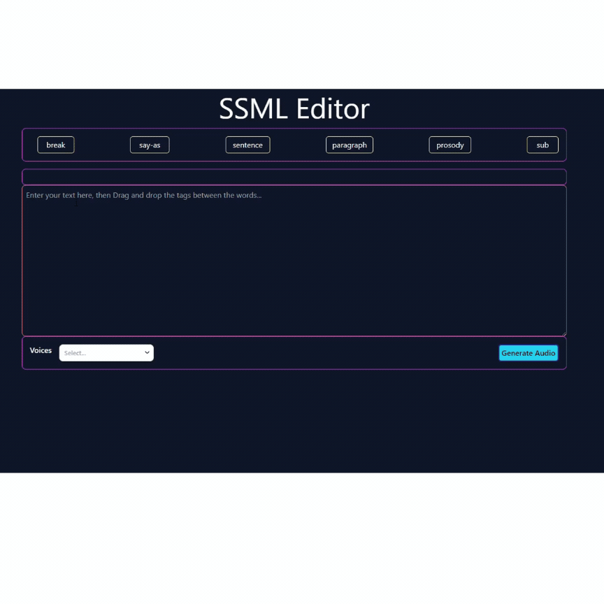

# SSML Editor 🗣️🎛️

[ssml-editor.netlify.app](https://ssml-editor.netlify.app/)

## About SSML Editor

The **SSML Editor** is a powerful tool designed to enhance speech synthesis by integrating with AWS Polly. Built with React, this editor allows users to create and manage Speech Synthesis Markup Language (SSML) content with ease. Whether you're a developer, content creator, or anyone who needs precise control over speech synthesis, the SSML Editor provides an intuitive and efficient way to craft perfect audio experiences.

## Key Features 🌟

👉 **AWS Polly Integration:** Seamlessly convert SSML text into high-quality speech using AWS Polly's extensive library of voices.

👉 **Drag-and-Drop Functionality:** Effortlessly manipulate SSML tag attributes with an intuitive drag-and-drop interface.

👉 **Audio Playback and MP3 Downloads:** Preview your SSML content with instant audio playback and download it as an MP3 file.

👉 **Minimalistic Design:** The editor features a sleek, user-friendly interface focused on simplicity and usability.

---

## Technologies Used 🛠️

- **React:** For building the user interface.
- **AWS Polly:** For text-to-speech conversion.
- **Netlify:** For deployment and hosting.

---



## Table of Contents 📚

- [Installation](#installation)
- [Usage](#usage)
- [Contributing](#contributing)
- [Contact Information](#contact-information)

## Installation 💻

To run this project locally, follow these steps:

1. Clone the repository:
    ```bash
    git clone https://github.com/manishsinghraj/ssml-editor
    ```
2. Navigate to the project directory:
    ```bash
    cd ssml-editor
    ```
3. Install dependencies:
    ```bash
    npm install
    ```
4. Start the development server:
    ```bash
    npm start
    ```
5. Open your browser and visit `http://localhost:3000` to use the SSML Editor.

## Usage 🎙️

Once the project is running, you can:

👉 **Create SSML content:** Use the text area to write SSML code, or drag and drop tags from the available options.

👉 **Convert SSML to speech:** Select your preferred voice from AWS Polly, and convert your SSML text into speech.

👉 **Preview and download:** Listen to the generated audio directly within the app and download it as an MP3 file for later use.

## Contributing 🤝

Contributions are welcome! Please follow these steps to contribute:

1. Fork the repository.
2. Create a new branch (`git checkout -b feature/YourFeature`).
3. Make your changes.
4. Commit your changes (`git commit -m 'Add your feature'`).
5. Push to the branch (`git push origin feature/YourFeature`).
6. Open a pull request.

## Contact Information 📬

For questions, suggestions, or contributions, please contact Manish Singh at [manishpurohit97@gmail.com](mailto:manishpurohit97@gmail.com).

---
